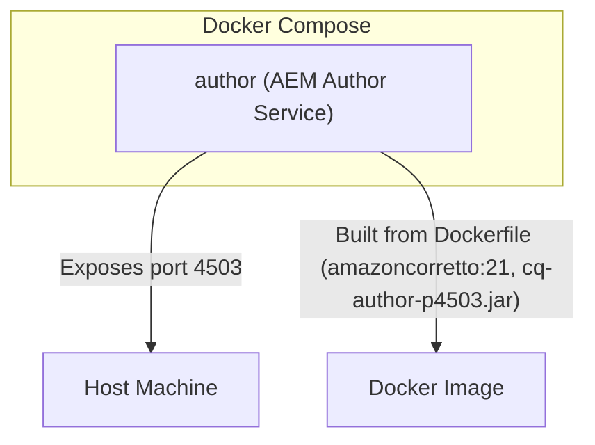

# AEM Author Docker Setup

This directory provides a minimal setup to run an Adobe Experience Manager (AEM) Author instance in a Docker container, suitable for local development or testing.

---

## Overview

- **Dockerfile**: Builds a container image based on [Amazon Corretto 21](https://hub.docker.com/_/amazoncorretto) (OpenJDK 21). It copies the `cq-author-p4503.jar` (AEM Author Quickstart JAR) into the image and sets the default command to run AEM Author with 1GB heap, verbose output, and GUI enabled.
- **docker-compose.yaml**: Defines a single service named `author` that builds from the Dockerfile and exposes port `4503` (the default AEM Author port) to the host.

---

## Tech Stack

- **Base Image**: [Amazon Corretto 21](https://hub.docker.com/_/amazoncorretto) (OpenJDK 21)
- **AEM Author**: Provided as `cq-author-p4503.jar` (place your licensed AEM jar here)
- **Docker Compose**: Version 3.8

---

## Usage

1. Place your AEM Author Quickstart JAR as `cq-author-p4503.jar` in this directory.
2. Ensure a `crx-quickstart` directory exists in this folder (it will be created automatically on first run if not present). This directory will persist your AEM repository data on your Mac.
3. (Optional) Place your `license.properties` file in this directory if you want to provide a custom license. If not present, AEM will generate it on first run.
4. Build and run the container:
   ```sh
   docker-compose up --build
   ```
5. Access AEM Author at [http://localhost:4503](http://localhost:4503)

---

## Architectural Considerations

- **Resource Requirements**: AEM is resource-intensive. The default heap is set to 1GB (`-Xmx1024M`), but for real projects, you may need to increase memory and CPU limits.
- **Persistence**: The `crx-quickstart` directory in your project folder is mounted into the container at `/usr/src/app/crx-quickstart` using a Docker volume. This ensures that repository data is persisted on your Mac between container runs. If you delete this folder, your AEM data will be lost.
- **Licensing**: You must provide your own, properly licensed AEM jar file. The `license.properties` file is optional—if not present, AEM will create it automatically on first run. If you want to provide a custom license, place the file in your project directory and it will be mounted into the container at `/usr/src/app/license.properties`.
- **Single Service**: Only the Author instance is included. For a full AEM stack, you may want to add Publish, Dispatcher, and other services.
- **Port Mapping**: Only port 4503 is exposed. Adjust as needed for your environment.
- **Architecture**: This setup is for x86_64/amd64. If you are on Apple Silicon (arm64), ensure your base image and AEM version are compatible.
- **Default Host Path**: This setup assumes you are running on a Mac. The `crx-quickstart` directory will appear in your local project folder by default.

---

## Diagram



---

## References
- [Adobe Experience Manager Documentation](https://experienceleague.adobe.com/docs/experience-manager.html)
- [Amazon Corretto](https://docs.aws.amazon.com/corretto/latest/corretto-21-ug/what-is-corretto-21.html)
- [Docker Compose](https://docs.docker.com/compose/) 